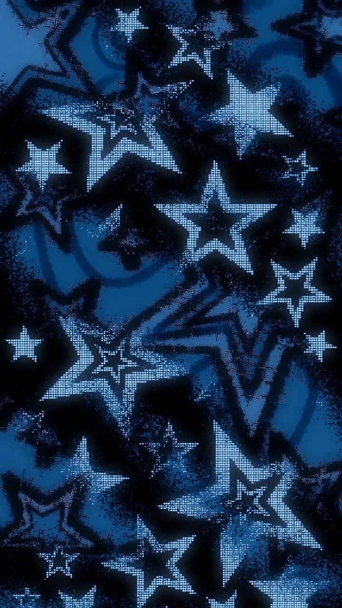

<!-- ====================================================== -->
<!--                       HERO                             -->
<!-- ====================================================== -->

  

<h1 align="center">SHLOK MISHRA</h1>

  

  
  
  

 

<!-- ====================================================== -->
<!--                        ABOUT                           -->
<!-- ====================================================== -->

  

<table align="center" width="94%">
<tr>

<td width="67%" valign="middle">

<h2>AI/ML Developer</h2>

I build practical, explainable, and production-ready systems across
<b>Machine Learning, Computer Vision, LLMs, RAG, and backend development.</b>

  

My work spans the complete development cycle — from model experimentation
and evaluation to explainability, REST APIs, deployment, and real-world
implementation.

  

I enjoy turning AI concepts into systems that are actually usable,
deployable, and built around real problems.

  

<code>BUILD</code> → <code>EXPLAIN</code> → <code>INTEGRATE</code> → <code>DEPLOY</code>

</td>

<td width="33%" align="center" valign="middle">
  
</td>

</tr>
</table>

 

<!-- ====================================================== -->
<!--                 TECHNICAL SPECIALIZATION               -->
<!-- ====================================================== -->

  

  

  <picture>
    <source media="(prefers-color-scheme: dark)" srcset="https://skillicons.dev/icons?i=python,postgres,tensorflow,sklearn,opencv,fastapi,flask,git,github,vite&theme=dark">
    
  </picture>

<table align="center" width="94%">
<tr>

<td width="25%" align="center" valign="top">
<b>MACHINE LEARNING</b>
 

Scikit-learn 
XGBoost 
LightGBM 
SHAP

</td>

<td width="25%" align="center" valign="top">
<b>COMPUTER VISION</b>
 

TensorFlow 
CNNs 
OpenCV 
Grad-CAM

</td>

<td width="25%" align="center" valign="top">
<b>GENERATIVE AI</b>
 

LLMs 
RAG 
LangChain 
LangGraph

</td>

<td width="25%" align="center" valign="top">
<b>BACKEND</b>
 

FastAPI 
Flask 
REST APIs 
Async Endpoints

</td>

</tr>
</table>

 

  
  
  
  
  

  
  
  
  
  

 

<!-- ====================================================== -->
<!--                PROFESSIONAL EXPERIENCE                 -->
<!-- ====================================================== -->

  

<table align="center" width="94%">
<tr>

<td width="30%" align="center" valign="middle">

EXPERIENCE / 01

<h2>WORKMATES</h2>

<b>Software Development Intern</b>

  

<code>May 2026 — August 2026</code>

  

Affiliated with 
<b>Pragatishil Bahuuddeshiya Sanstha, Washim</b>

</td>

<td width="70%" valign="middle">

<h3>Production Web Development</h3>

Delivered <b>two production institutional platforms</b> for
<b>Sunita Nursing School</b> and
<b>Narendra Suryawanshi College of Pharmacy</b>, converting fragmented
admissions, academic, faculty, approval, compliance, and contact information
into structured digital systems.

  

Designed reusable modules and a lightweight internal workflow for
institutional records, document access, notices, enquiries, and recurring
content updates based on stakeholder requirements.

  

Managed production releases through <b>Git/GitHub and Hostinger</b>,
including responsive testing, EmailJS integration, DNS/SSL setup, indexing,
sitemap and canonical metadata, troubleshooting, and post-launch maintenance.

</td>

</tr>
</table>

 

  LIVE / PRODUCTION DEPLOYMENTS

<table align="center" width="86%">
<tr>

<td width="50%" align="center" valign="middle">

<b>SUNITA NURSING SCHOOL</b>

  

  

Production institutional platform

</td>

<td width="50%" align="center" valign="middle">

<b>NARENDRA SURYAWANSHI COLLEGE OF PHARMACY</b>

  

  

Production institutional platform

</td>

</tr>
</table>

 

  
  
  
  
  
  
  

 

<!-- ====================================================== -->
<!--                     SELECTED WORK                      -->
<!-- ====================================================== -->

  

<table align="center" width="94%">
<tr>

<td width="50%" valign="top">

PROJECT / 01

<h3>Prithvi Agro AI</h3>

Explainable agricultural decision-support system combining
<b>machine learning, SHAP, weather/soil data, market intelligence,
and an LLM/RAG assistant.</b>

  

</td>

<td width="50%" valign="top">

PROJECT / 02

<h3>Advanced Deepfake Detection</h3>

Explainable media-forensics pipeline using
<b>CNN inference, RetinaFace, Grad-CAM, FastAPI, and
blockchain-compatible authenticity verification.</b>

  

</td>

</tr>
</table>

 

<table align="center" width="47%">
<tr>

<td width="100%" valign="top">

PROJECT / 03

<h3>Neuro Detect AI</h3>

CNN-based MRI screening prototype with preprocessing,
confidence-based inference, and automated reporting,
achieving approximately <b>90% validation accuracy</b>
on the project dataset.

  

</td>

</tr>
</table>

 

<!-- ====================================================== -->
<!--                       HIGHLIGHTS                       -->
<!-- ====================================================== -->

  

<table align="center" width="86%">

<tr>
<td width="8%" align="center"><b>01</b></td>
<td><b>Smart India Hackathon Finalist</b> — AI-based smart farming solution</td>
</tr>

<tr>
<td width="8%" align="center"><b>02</b></td>
<td><b>IEEE Student Branch Team Lead</b> — technical coordination, hackathons & workshops</td>
</tr>

<tr>
<td width="8%" align="center"><b>03</b></td>
<td><b>Google Solution Challenge</b> — UN SDG-aligned technology solution</td>
</tr>

<tr>
<td width="8%" align="center"><b>04</b></td>
<td>Shipped <b>2 production institutional platforms</b></td>
</tr>

<tr>
<td width="8%" align="center"><b>05</b></td>
<td>Building across <b>ML, Computer Vision, LLM/RAG & AI-backed applications</b></td>
</tr>

</table>

 

<!-- ====================================================== -->
<!--                        FOOTER                          -->
<!-- ====================================================== -->

  <code>MODEL</code>
  &nbsp;→&nbsp;
  <code>EXPLAIN</code>
  &nbsp;→&nbsp;
  <code>INTEGRATE</code>
  &nbsp;→&nbsp;
  <code>DEPLOY</code>

  Building intelligent systems that move beyond notebooks and into real-world use.

 

