

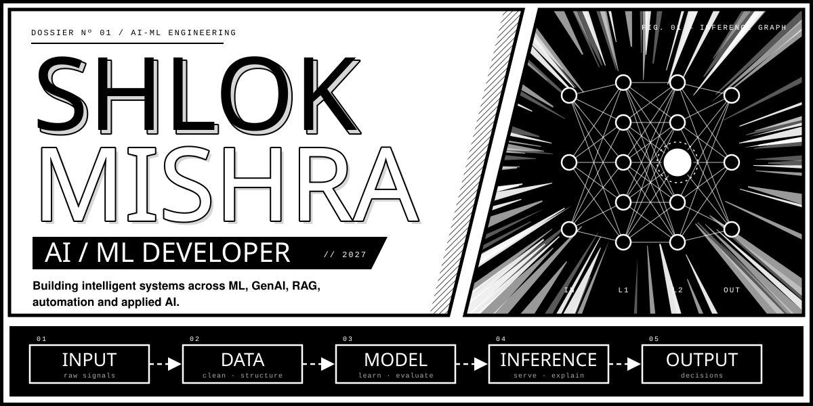

 

  

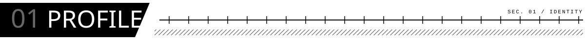
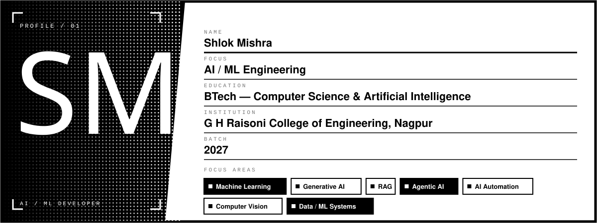

 

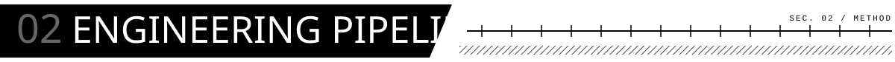
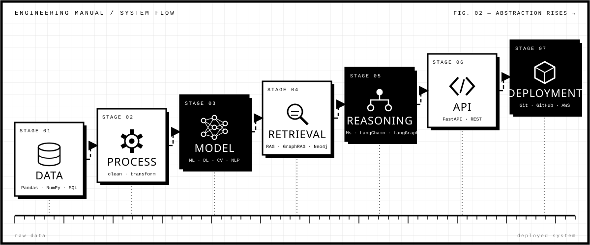

 

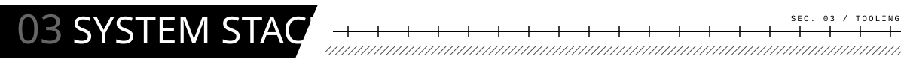
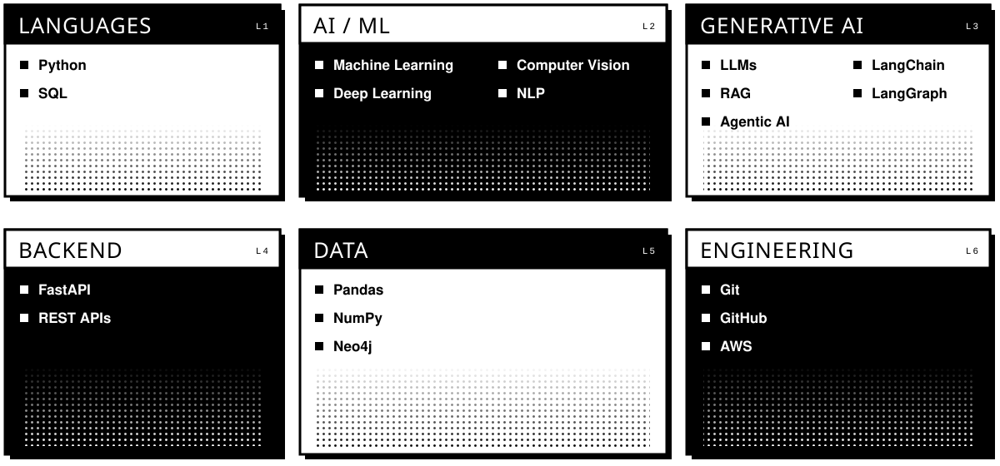

 

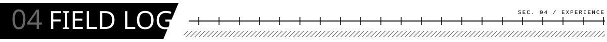
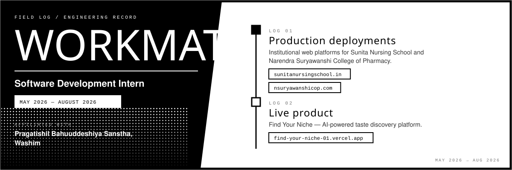

<a href="https://sunitanursingschool.in/">sunitanursingschool.in</a> &nbsp;·&nbsp;
<a href="https://nsuryawanshicop.com/">nsuryawanshicop.com</a> &nbsp;·&nbsp;
<a href="https://find-your-niche-01.vercel.app/">find-your-niche-01.vercel.app</a>

  

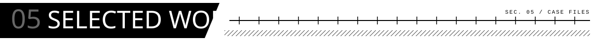

<a href="https://github.com/ShlokMishra01/prithvi-agro-ai">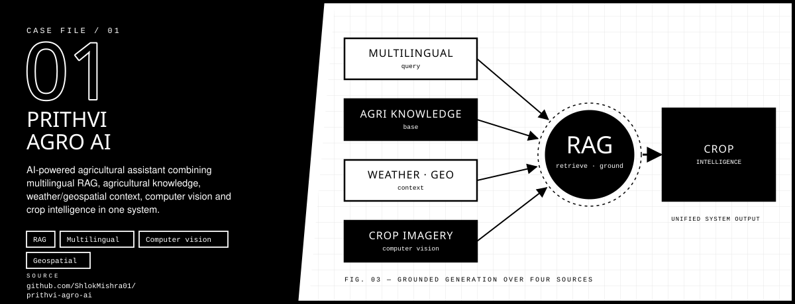</a>

<a href="https://github.com/ShlokMishra01/Find-your-niche-">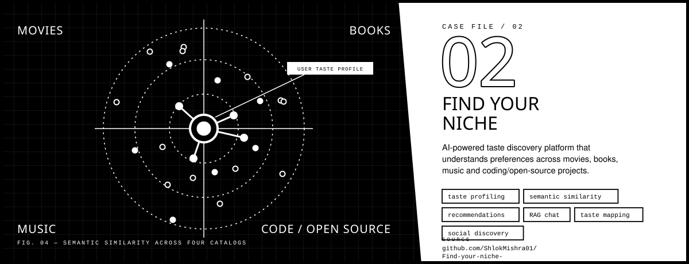</a>
<a href="https://find-your-niche-01.vercel.app/">Live demo</a> &nbsp;·&nbsp; <a href="https://github.com/ShlokMishra01/Find-your-niche-">Repository</a>

<a href="https://github.com/ShlokMishra01/Deepfake-Image-and-video-analyzer">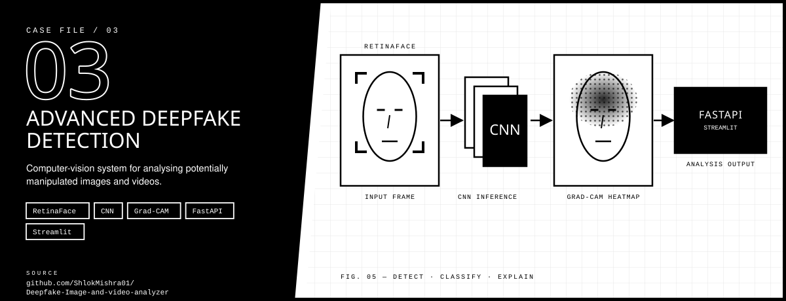</a>

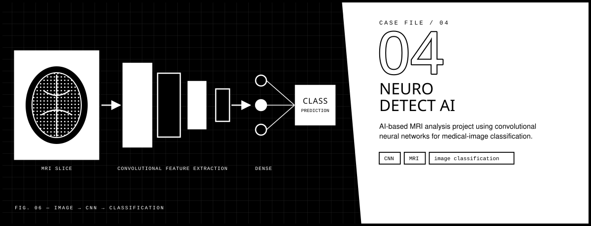

<a href="https://github.com/ShlokMishra01/Fintech-assistant-model-with-neo4j-and-Python">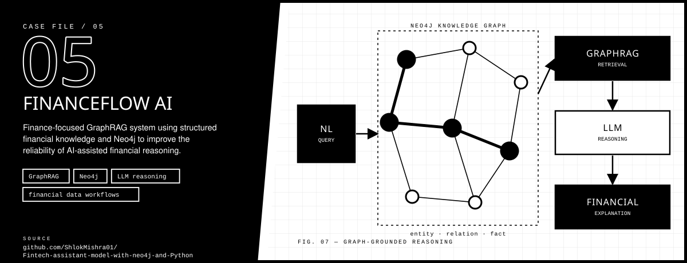</a>

 

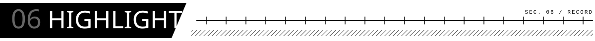
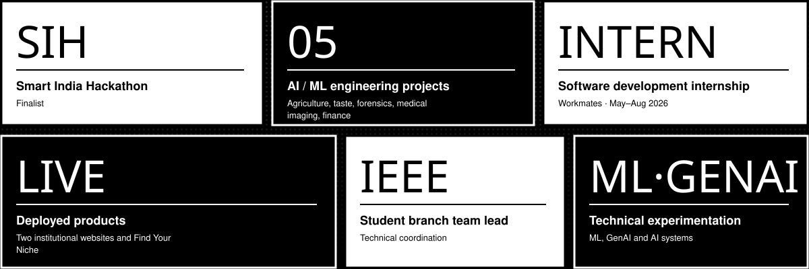

 

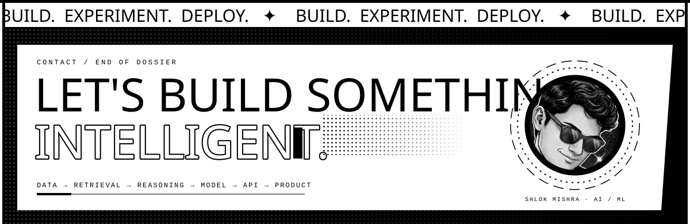

